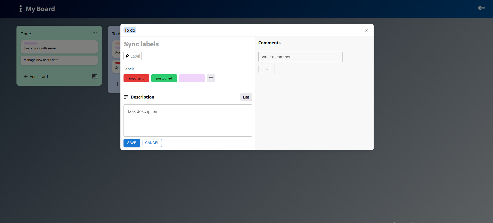

# Trello Clone - Task Management App

A full-stack Trello-inspired task management application built with React and Express.js. Organize your work with workspaces, boards, columns, and cards using an intuitive drag-and-drop interface.


## 📸 Screenshots




## ✨ Features

- **Workspaces** - Create and manage multiple workspaces to organize different projects
- **Boards** - Visual boards to track project progress
- **Columns & Cards** - Organize tasks in customizable columns with drag-and-drop functionality
- **Labels** - Color-coded labels for categorizing and filtering cards
- **Team Collaboration** - Add members to workspaces for team projects
- **OAuth Authentication** - Sign in with GitHub, Facebook or Google
- **Dark/Light Mode** - Toggle between themes for comfortable viewing
- **Drag & Drop** - Intuitive card and column reordering with @dnd-kit

## 🛠️ Tech Stack

### Frontend
- **React 19** - UI library
- **React Router DOM** - Client-side routing
- **Material UI (MUI)** - Component library
- **@dnd-kit** - Drag and drop functionality
- **Axios** - HTTP client
- **React Three Fiber** - 3D graphics (decorative elements)

### Backend
- **Express.js 5** - Web framework
- **PostgreSQL** - Database
- **JSON Web Tokens (JWT)** - Authentication
- **bcrypt** - Password hashing
- **OAuth 2.0** - GitHub, Facebook & Google social login

## 📁 Project Structure

```
trello/
├── backend/
│   ├── main.js              # Express server entry point
│   ├── db.js                # PostgreSQL connection
│   ├── middleware/
│   │   └── requireAuth.js   # JWT authentication middleware
│   └── routes/
│       ├── auth.js          # Authentication routes (OAuth, login/register)
│       ├── boards.js        # Board CRUD operations
│       ├── cards.js         # Card CRUD operations
│       └── workspace.js     # Workspace management
│
└── frontend/
    ├── public/
    └── src/
        ├── components/      # Reusable UI components
        ├── context/         # React Context (App & User state)
        └── pages/           # Page components
```

## 📝 API Endpoints

### Authentication
| Method | Endpoint | Description |
|--------|----------|-------------|
| GET | `/auth/github/login` | Initiate GitHub OAuth |
| GET | `/auth/github/callback` | GitHub OAuth callback |
| GET | `/auth/facebook/login` | Initiate Facebook OAuth |
| GET | `/me` | Get current user info |

### Workspaces
| Method | Endpoint | Description |
|--------|----------|-------------|
| GET | `/workspace/current` | Get current workspace |
| GET | `/workspace/:id` | Get workspace by ID |
| POST | `/workspace/new` | Create new workspace |
| PATCH | `/workspace/:id` | Update workspace |

### Boards
| Method | Endpoint | Description |
|--------|----------|-------------|
| GET | `/boards/all` | Get all boards in workspace |

### Cards
| Method | Endpoint | Description |
|--------|----------|-------------|
| Various | `/cards/*` | Card CRUD operations |

## How can I use it?

Worry not young developer, this website will soon be up and online. Free of use for every team that needs it and for everyone.


## 🤝 Contributing

1. Fork the repository
2. Create a feature branch (`git checkout -b feature/amazing-feature`)
3. Commit your changes (`git commit -m 'Add amazing feature'`)
4. Push to the branch (`git push origin feature/amazing-feature`)
5. Open a Pull Request

## 📄 License

This project is open source and available under the [MIT License](LICENSE).

---

Made with ❤️ using React and Express.js
